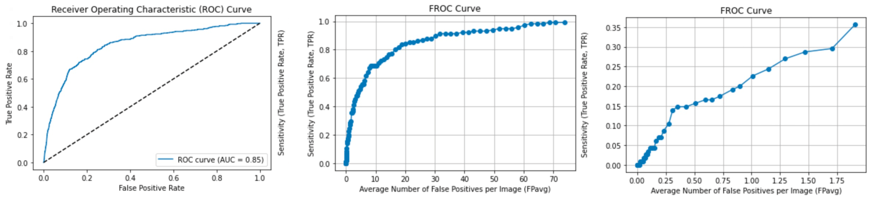

# Breast Mass Detection System Based on a Multi-scale Approach

  

**Authors:** Xavier Beltran Urbano, Clara Lisazo and Luisana Álvarez Monsalve

## Dataset

For the development of this approach, the **INbreast dataset** has been used, which contains 410 mammograms. These include 115 masses belonging to 107 positive images, and 303 negative images, that were free of abnormalities.

## Project Methodology and Result

The proposed approach for mass detection and segmentation consists of 4 main steps, which are pre-processing, multi-scale grayscale morphology and segmentation, feature extraction, and classification. ucasML tool was used for obtaining a classification score using 10-fold cross-validation for each region candidate for a binary classification task as it is robust to class imbalance. This project also includes the feature extraction process and evaluation methods used.

The approach presented in this project was implemented and evaluated on the InBreast mammographic dataset, which was able to segment mass lesions from the background accurately with a **sensitivity of 99.07%**. Various features were extracted from raw images and used in training the ucasML tool. ucasML tool was able to provide satisfactory scores for both labels based on the features trained with while facing a high class imbalance. In general, the proposed system achieves promising results in both detection and segmentation of mammogram masses.

  

